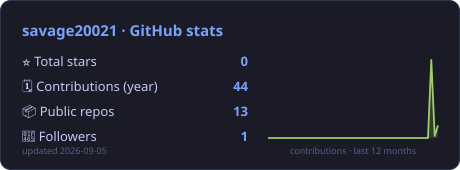
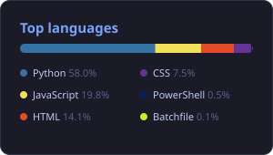

# 📊 profile-cards

**Self-hosted GitHub profile stat cards.** A zero-dependency Python script renders your GitHub stats as SVG cards, and a scheduled GitHub Action refreshes them daily — so your profile README never again shows a broken image because someone else's free card service got rate-limited.

These are the live cards this repo generates for me:

<p>
  
  
</p>

## Why

The popular readme-stats services run on shared free-tier hosting and break under GitHub API rate limits — profiles end up with broken image icons at random. This repo replaces them with two files **you** own, rendered from the GitHub GraphQL API by **your** Actions runner with **your** built-in token. No external service, no rate-limit roulette, no tracking.

## What you get

- **stats.svg** — stars, contributions over the last year, public repo count, followers, plus a 52-week contribution sparkline and an "updated" date so freshness is visible.
- **langs.svg** — top six languages across your public repos by code size, with GitHub's own language colours.

Both cards are plain hand-rolled SVG (no chart library), themed [tokyonight](https://github.com/enkia/tokyo-night-vscode-theme), ~2 KB each.

## Use it for your own profile

1. **Fork this repo** (or copy `generate.py` + `.github/workflows/refresh.yml` into any repo).
2. That's it — no configuration. The script targets the repo owner's stats automatically and the workflow uses the built-in `GITHUB_TOKEN`. Push to `main` or hit *Run workflow* to generate the first cards.
3. Embed them in your profile README:

```html


```

The workflow runs daily at 20:17 UTC (edit the cron in `refresh.yml` to taste) and only commits when something changed.

### Run locally

```bash
GITHUB_TOKEN=$(gh auth token) GH_LOGIN=your_username python generate.py
```

Python 3.9+, standard library only.

### Customise

All colours live in one block at the top of `generate.py`; the two card layouts are two small functions of plain SVG strings. Change them freely — there is no framework in the way.

## Licence

MIT — see [LICENSE](LICENSE).

---

*Built AI-assisted (Claude) — my direction, AI-assisted code.*
